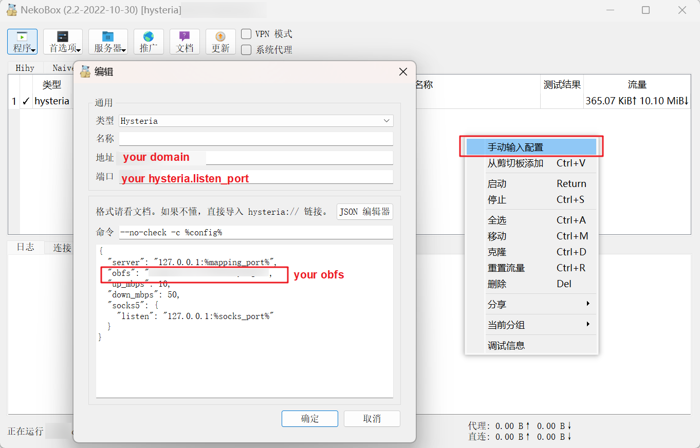
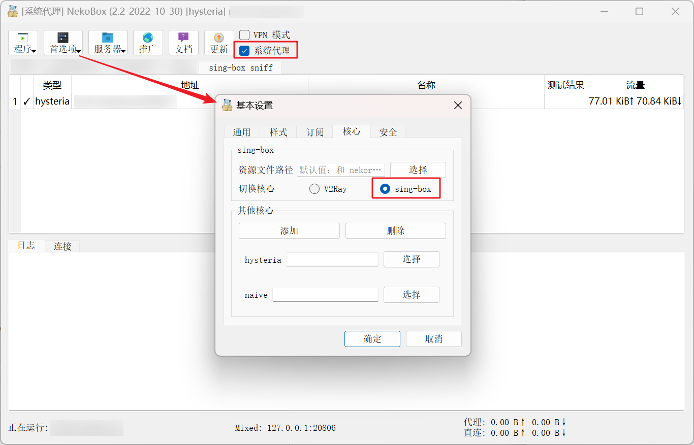

# singbox-muggle
sing-box 麻瓜自用

## Preview

check golang version >= 1.18.7

```bash
snap install go --classic && source /etc/profile
```

## Usage

1. **Install**

   In this case, sing-box carries the [compilation parameters](https://github.com/SagerNet/sing-box/blob/16d959e6770932e88608cb3487b87f7c21eab103/release/local/install.sh#L13) `quic`, `wireguard` and `acme`.

```bash
cd /home \
&& git clone https://github.com/SagerNet/sing-box \
&& cd sing-box \
&& ./release/local/install.sh
```

2. **Configure**

   Copy the [server config](#tempalte) of the hysteria given below and follow the prompt to modify it.

```bash
vim /usr/local/etc/sing-box/config.json
```

3. **Debugging**

   Before doing so, you need to run sing-box in the foreground using the following command, which is helpful for debugging.

```bash
sing-box run -c /usr/local/etc/sing-box/config.json
```

4. **Enable system service**

   Deploy the system services when you feel it is appropriate.  [See more details](https://sing-box.sagernet.org/examples/linux-server-installation/)

```bash
/home/sing-box/release/local/enable.sh
```

5. **Update though git**

   sing-box is still a project in its formative years and is updated very frequently. I don't think this scripted update is best practice at the moment, but it's better than nothing :D

```bash
/home/sing-box/release/local/update.sh
```

5. **Uninstall**

```bash
/home/sing-box/release/local/uninstall.sh
```

## Configuration

### Structure

[official docs](https://sing-box.sagernet.org/configuration/outbound/hysteria/)

```json
{
  "log": {},
  "dns": {},
  "inbounds": [],
  "outbounds": [],
  "route": {},
  "experimental": {}
}
```

### Server

<span id='tempalte'></span>

Edit the configuration in the way you like.  

Replace the following **inbounds** placeholders: `obfs`, `domain`. If you don't know what the other configurations mean at the moment, then just replace the domain without changing the other configurations. 

The `domain` must be real and valid and have resolved to the server's IPv4 (**without CDN**). 

```json
{
    "log": {
        "level": "info"
    },
    "dns": {
        "servers": [
            {
                "tag": "Cloudflare",
                "address": "https://1.1.1.1/dns-query"
            }
        ]
    },
    "inbounds": [
        {
            "type": "hysteria",
            "tag": "hysteria-in",
            "listen": "::",
            "listen_port": 58403,
            "up_mbps": 100,
            "down_mbps": 125,
            "obfs": "ごちそうさまでした",  // ←
            "tls": {
                "enabled": true,
                "server_name": "awesome.domain.com",  // ←
                "acme": {
                    "domain": "awesome.domain.com",  // ←
                    "email": "pekora@awesome.domain.com"  // ←
                }
            }
        }
    ],
    "outbounds": [
        {
            "type": "direct"
        },
        {
            "type": "dns",
            "tag": "dns-out"
        }
    ],
    "route": {
        "rules": [
            {
                "protocol": "dns",
                "outbound": "dns-out"
            }
        ]
    }
}
```

### Client

Complete the final relay with [NekoRay](https://github.com/MatsuriDayo/nekoray). 

1. **Edit client configuration**

   

2. **Enable sing-box core, select node, open system proxy** 

## Reference

[sing-box official documentation](https://sing-box.sagernet.org/examples/linux-server-installation/#other-commands)

[Advanced Usage · HyNetwork/hysteria Wiki](https://github.com/HyNetwork/hysteria/wiki/Advanced-Usage)
